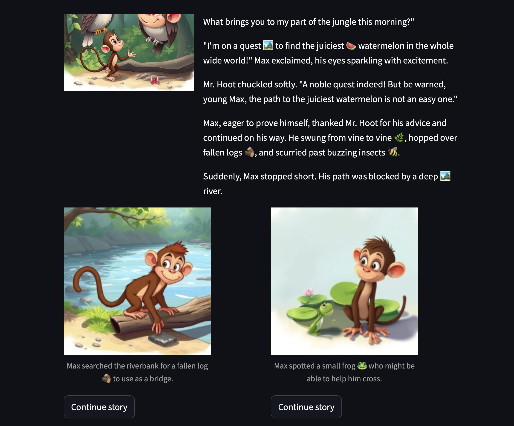

# LLMs tell an interactive story

This app combines LLMs and vision models to generate short interactive stories for kids. 
Each story goes on for a few chapters, and after each chapter users can choose one of a few possible continuations.

## Example

## How to run

- edit the config file
- run `streamlit run app.py --server.port 8081`

